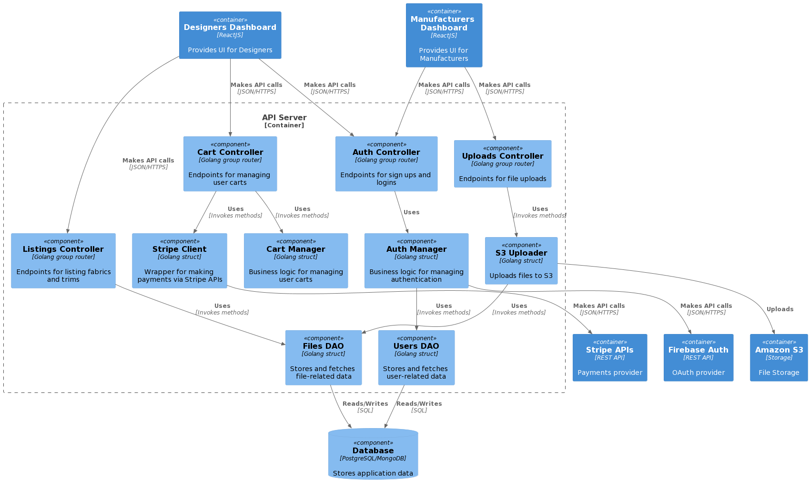

### Running the BarberShop Application (with make)
I have added a Makefile to automate the process of building, running, and testing the application. Kindly see the instructions below : 

- `make build` builds a binary called `barbershop` in the root directory.
- `make run` builds the binary as explained above and runs it.
- `make run` is intended to run unit test (though there are none because it's difficult testing concurrent code).

### Running the BarberShop Application (with Docker)
Please follow the instructions below to run the app using docker : 

- run `docker build -t barbershop:v1`
- run `docker run -d --name barbershop barbershop:v1`
- run `docker logs barbershop` to view logs from the app

When the application starts, it loads some environment variables to tweak how it works. However, in the absence of explicit definitions of these values, certain default values are used.

To modify the behaviour of this applications, set the following env vars : 

- `SEAT_CAPACITY` : (defaults to 10) sets number of seats in the waiting area.
- `ARRIVAL_RATE_IN_SEC` : (defaults to 100) determines the interval within which we simulate the arrival of new customers to the shop.
- `CUT_DURATION_IN_MSEC` : (defaults to 1000) determines how long it hypothetically takes a barber to finish one job.
- `OPENED_UNTIL_IN_SEC` : (defaults to 10) determines how long the shop is opened for a day.
- `ENVIRONMENT` : (defaults to `development`) determines the environment within which the app is running. This modifies how the logger writes messages. The format of the production logger could be used in a centralized logging system such as Graylogs.

### Architecture diagram for System Design question
The image below is the architectural diagram of how I would design a solution for the system explained in Question 2 of the assignment.

### What I could improve

- I could have added tests the content of what is printed in the logs for certain scenarios in the barbershop application. However, it's not straight-forward to test concurrent code sometimes.
- In the architecture of the system described in Question 2, I could have a variation where the `Designers Dashboard` and `Manufacturers Dashboard` are merged into one application. However, in real-life situation, there is an advantage to separating them to avoid a single source of failure. Also, different development teams can be assigned to focus on specific dashboards.
- In the same architectural diagram, I could have a variation where the `Designers Dashboard` and `Manufacturers Dashboard` authenticate directly on Firebase Auth without going through the `Auth Controller`. This way, the token received after a successful authentication on Firebase could be used for API authentication. However, this approach would let us miss out on being able to implement custom business rules during authentication.